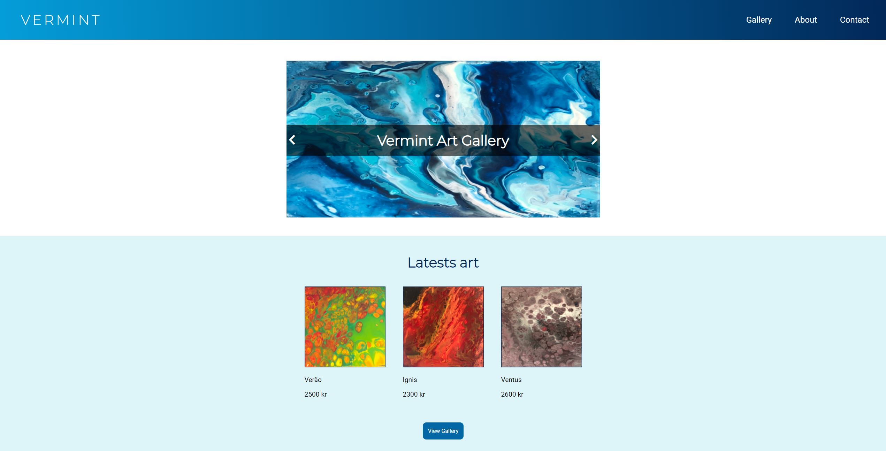
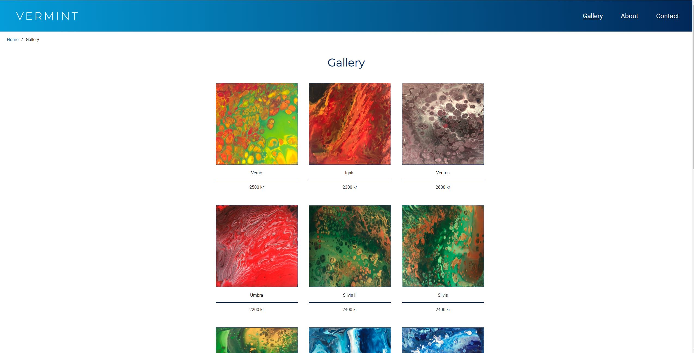

# Vermint Gallery

> An e-commerce website for selling paintings
> Live demo [_here_](https://vermintgallery.netlify.app). <!-- If you have the project hosted somewhere, include the link here. -->

## Table of Contents

- [General Info](#general-information)
- [Technologies Used](#technologies-used)
- [Features](#features)
- [Screenshots](#screenshots)
- [Setup](#setup)
- [Usage](#usage)
- [Project Status](#project-status)
- [Room for Improvement](#room-for-improvement)
- [Acknowledgements](#acknowledgements)
- [Contact](#contact)
<!-- * [License](#license) -->

## General Information

- This project displays products from a wordpress REST API, which the owner can add themselfs.
- Makes it easy for the owner/user to add his/hers products.
<!-- You don't have to answer all the questions - just the ones relevant to your project. -->

## Technologies Used

- HTML
- CSS
- Javascript

## Features

List the ready features here:

- Displays products from wordpress rest api

## Screenshots

<!-- If you have screenshots you'd like to share, include them here. -->

## Setup

Step 1

- Buy a domain or work on local server

Step 2

- Install wordpress on the server

Step 3

- Add your products and call the API

## Project Status

Project is: _in progress_.

## Room for Improvement

Room for improvement:

- Contact form is not functional

To do:

- Learn php, and make contact form send e-mail to owner.

## Contact

Created by [@EivindSimonsen](https://www.linkedin.com/in/eivind-simonsen-9469121b9/) - feel free to contact me!
